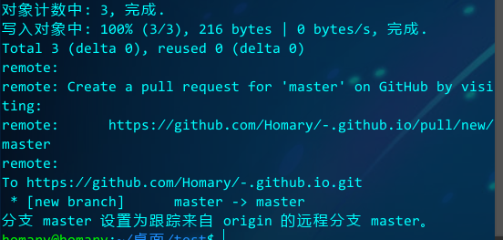
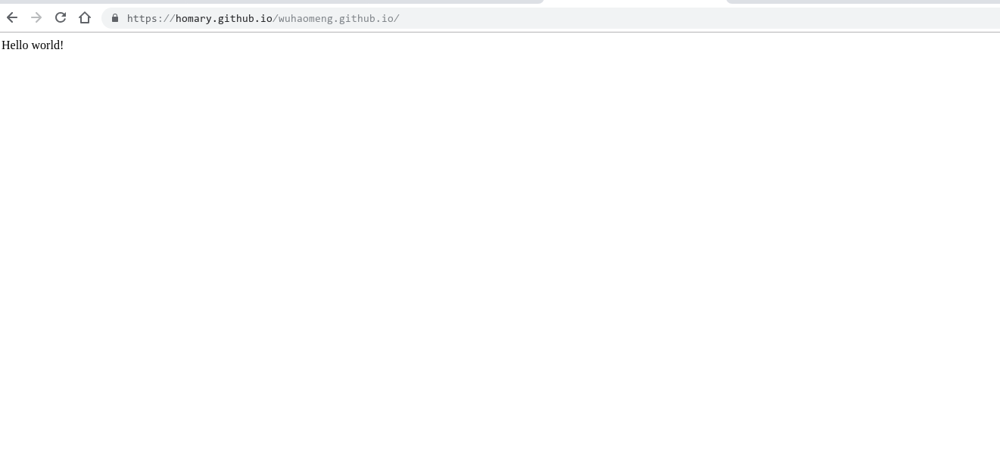

### toReady  
<br>
首先你需要一个 github 账号. 什么? 没有! => <a href="https://www.github.com">www.github.com</a>  
### toDo  
<br>
1. 新建一个仓库.  
  
    

    

    

    
2. 在本地初始化一个仓库  
<br>  
新建一个文件夹,在该文件夹下打开控制台  

``` 
git  init // 初始化为一个空仓库  
```

在该目录下新建一个index.html,随便写点东西.并提交  
```
 git add .  
 git commit -m "初始化"  
```

3. 关联本地仓库与远程仓库  
复制在github上创建好仓库之后显示的**…or push an existing repository from the command line**标题下的那两行代码,在本地仓库控制台输入.接着输入你的github账户名以及密码,如果出现下面的提示则成功.  



### 引入jekyll模板  
> 现在我们在github上刷新我们刚创建的仓库,已经能看到我们刚刚提交的文件了.  

  

在setting在看 GitHub Pages, 点击下面给的连接就可以看到我们在index.html写的东西.  

  
   

现在我们就已经完成了我们的博客首页了,但是我们不能总是写html静态文件,我们要打造的是博客网站,这就需要用到jekyll这个工具.如果不想花时间学Jekyll语法的话,我们可以直接下载别人的模板.  

> <a href="https://www.jekyll.com.cn/docs/structure/">jekyll中文网---目录结构</a>

1. 在 <a href="http://jekyllthemes.org/">jekyllthemes</a>在下载一个自己喜欢的模板  
2. 按照之间的步骤把下载好的模板上床到自己的Github远程仓库  
3. 在_post文件夹中放入自己写好的博客, 文件名必须是 年份-月份-日-标题  
4. 上传博客到Github中就可以访问.  
<br>
### 我们还需要给我们的博客添加评论功能,这要用到gitment.  
#### 申请一个Github OAuth Application  
Github头像下拉菜单 > Settings > 左边Developer settings下的OAuth Application > Register a new application，填写相关信息：

1. Application name, Homepage URL, Application description 都可以随意填写.

2. Authorization callback URL 一定要写自己Github Pages的URL.

3. 填写完上述信息后按Register application按钮，得到Client ID和Client Secret.  

#### 在jekyll博客调用gitment　　
在你需要添加评论系统的地方，一般是_layout/目录下的 post.html, 添加一下代码:　

```

<div id="gitmentContainer"></div>
<link rel="stylesheet" href="https://imsun.github.io/gitment/style/default.css">
<script src="https://imsun.github.io/gitment/dist/gitment.browser.js"></script>
<script>
    var gitment = new Gitment({
        id: '<%= page.date %>',
        owner: '你的github名',
        repo: '你的仓库名',
        oauth: {
            client_id: '上面得到的 Client ID',
            client_secret: '上面得到的 Client Secret',
        },
    });
    gitment.render('gitmentContainer')
</script>

```

#### 初始化评论系统　　
1. 将上面代码添加成功并上传之后，就可以在博客页下看到一个评论框，还有看到以下错误*Error: Comments Not Initialized*.说明该篇博文的评论系统还没初始化.  
2. 点击 Login with github后,使用github账号登陆,就可以看到上面错误信息处出现一个 *Initialize Comments*的按钮.  
3. 点击Initialize Comments按钮后，就可以开始对该篇博文开始评论了， 同时也可以在对应的github仓库看到相应的issue。

#### gitment汉化  
将上面模板里引入的CSS和js改成
```
<link rel="stylesheet" href="https://billts.site/extra_css/gitment.css">
<script src="https://billts.site/js/gitment.js"></script> 
```
遇到坑可以参考这个 <a href="https://www.jianshu.com/p/57afa4844aaa">Gitment评论功能接入踩坑教程</a>