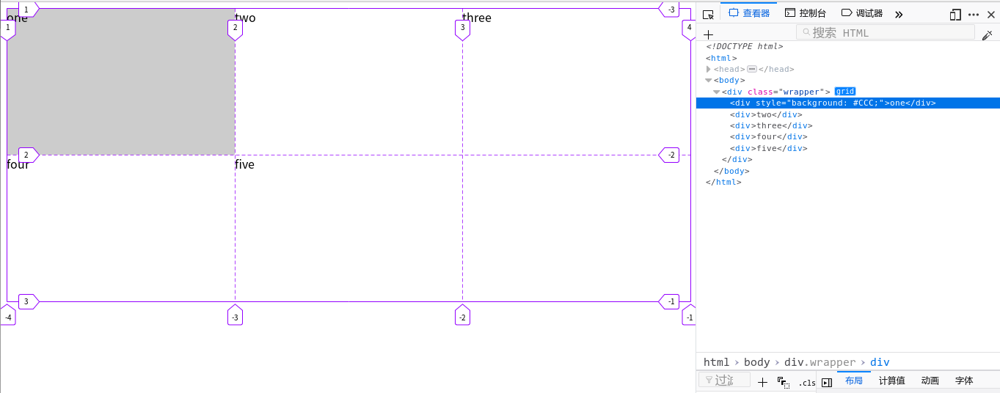
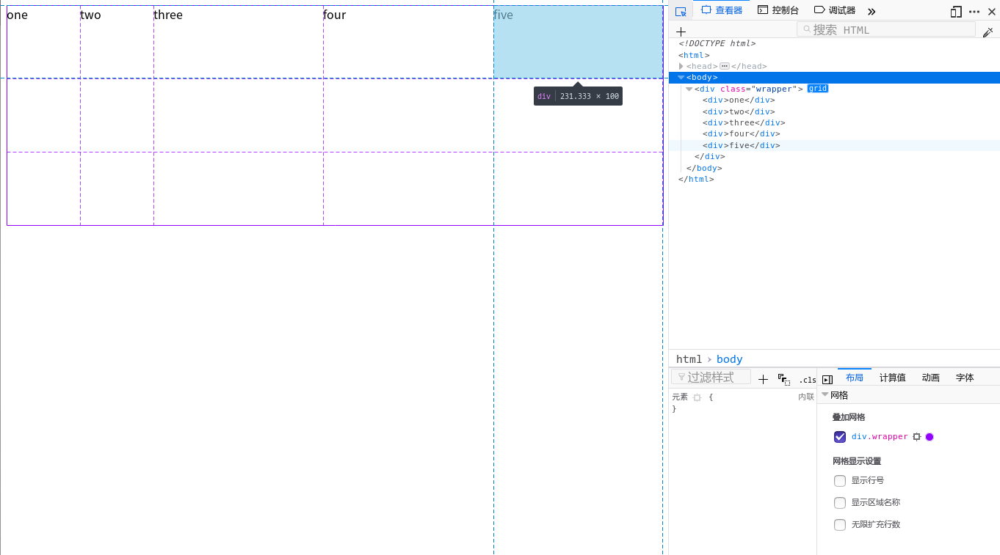
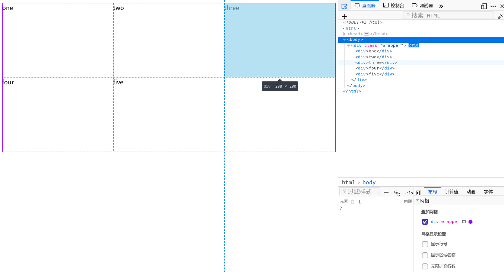
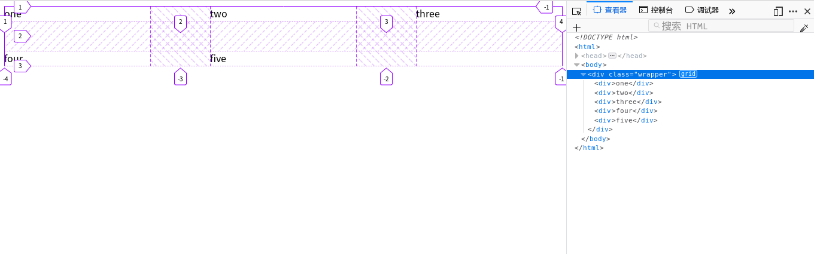

## 网格布局  
> CSS网格布局引入了二维网格布局系统，可用于布局页面主要的区域布局或小型组件.  

### 网格容器  
通过在元素上声明`display: grid`或`display: inline-grid`来创建一个网格容器;  
这个元素的所有直系子元素都会成为网格元素.  

### 网格单元 网格轨道 网格线  
  
- 网格单元: 每一个格都是一个一个网格单元
- 网格轨道: 行轨道和列轨道  
- 网格线: 默认从左到右,从上到下开始为1,结尾为-1  

### 轨道大小  
- grid-template-columns: 定义网格的列轨道属性  
> 用法: 列宽度 列宽度(有多少列就写多少个)  

- grid-template-rows: 定义网格的行轨道属性  
> 用法: 与`grid-template-rows`一样  

- grid-template: `grid-template-rows`和`grid-template-columns`的缩写  
> 用法: rows / cols

- fr单位: 代表网格容器中可用空间的一等份  

- repeat(): 定义重复的行或者列  
> 用法: repeat(数量, 大小)  

- minmax(): 定义了一个长宽范围的闭区间  
> 用法: minmax(最小值, 最大值)  

下面我们声明一个网格容器.  
```  
<div class="wrapper">
    <div>one</div>
    <div>two</div>
    <div>three</div>
    <div>four</div>
    <div>five</div>
</div>
```  
将列数设置为5列:前两列大小为100px,后三列大小为可用空间的等份    
将函数设置为3行:高度最小为100px, 当内容超过100px自适应高度    
``` 
.wrapper{  
    display: grid;  
    grid-template-columns: repeat(2, 100px) repeat(3, 1fr);  
    grid-template-rows: repeat(3, minmax(100px, auto));  
} 
或用`grid-template`
.wrapper{  
    display: grid;  
    grid-template:repeat(3,minmax(100px,auto)) / repeat(2,100px) repeat(3,1fr);  
} 
```  
;

我们使用Firefox打开,在控制台可以看到定义为网格容器的元素旁边有个gird标识  
我们打开它就可以在页面看到我们定义的网格.  

### 隐式和显式网格: 上面我们用`grid-template-columns`和`grid-template-rows`显式创建了一个3行5列的网格.但如果我们的内容超出了显式定义的网格大小,需要更多的网格的时候,网格将会在隐式网格中创建行和列  

我们可以用`grid-auto-columns`和`grid-auto-rows`属性定义隐式网格中创建的轨道大小  

``` html  
<div class="wrapper">
   <div>One</div>
   <div>Two</div>
   <div>Three</div>
   <div>Four</div>
   <div>Five</div>
</div>
```  
``` css  
.wrapper {
  display: grid;
  grid-template-columns: repeat(3, 1fr);
  grid-auto-rows: 200px;
}
```  
   

### 网格间距  
- grid-row-gap: 网格横向间距  
- grid-column-gap: 网格纵向间距  
- grid-gap: `grid-row-gap`和`grid-column-gap`的缩写  
> 用法 grid-gap: 横向间距 / 纵向间距  

我们创建一个横向间距为50px, 纵向间距为100px的网格  
``` HTML  
<div class="wrapper">
   <div>One</div>
   <div>Two</div>
   <div>Three</div>
   <div>Four</div>
   <div>Five</div>
</div>
```  
``` CSS  
.wrapper{
    display: grid;
    grid-template-column: repeat(3, 1fr);
    grid-gap: 50px / 100px; 
}
``` 

