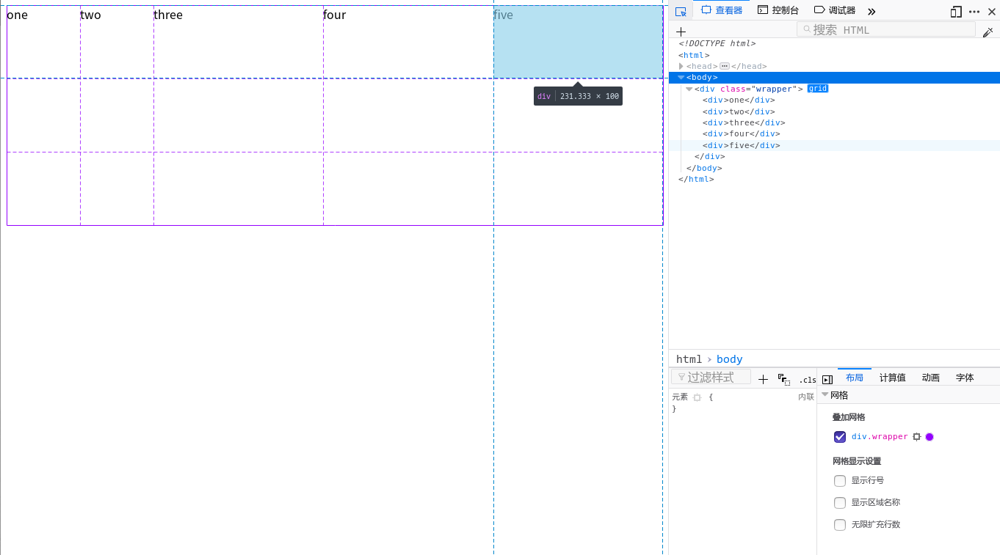
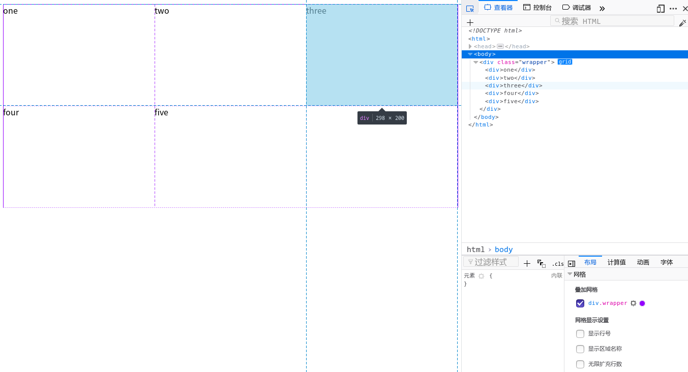

## 网格布局  

> CSS网格布局引入了二维网格布局系统，可用于布局页面主要的区域布局或小型组件.  

### 网格容器  

通过在元素上声明`display: grid`或`display: inline-grid`来创建一个网格容器;  
这个元素的所有直系子元素都会成为网格元素.  

### 网格单元 网格轨道 网格线  

  

- 网格单元: 每一个格都是一个一个网格单元  

- 网格轨道: 行轨道和列轨道  

- 网格线: 默认从左到右,从上到下开始为1,结尾为-1  


### 轨道大小  

- grid-template-columns: 定义网格的列轨道属性  
> 用法: 列宽度 列宽度(有多少列就写多少个)  

- grid-template-rows: 定义网格的行轨道属性  
> 用法: 与`grid-template-rows`一样  

- grid-template: `grid-template-rows`和`grid-template-columns`的缩写  
> 用法: rows / cols

- fr单位: 代表网格容器中可用空间的一等份  

- repeat(): 定义重复的行或者列  
> 用法: repeat(数量, 大小)  

- minmax(): 定义了一个长宽范围的闭区间  
> 用法: minmax(最小值, 最大值)  

下面我们声明一个网格容器.  

```  html
<div class="wrapper">
    <div>one</div>
    <div>two</div>
    <div>three</div>
    <div>four</div>
    <div>five</div>
</div>
```  

将列数设置为5列:前两列大小为100px,后三列大小为可用空间的等份    
将函数设置为3行:高度最小为100px, 当内容超过100px自适应高度    

``` html
.wrapper{  
    display: grid;  
    grid-template-columns: repeat(2, 100px) repeat(3, 1fr);  
    grid-template-rows: repeat(3, minmax(100px, auto));  
} 
或用grid-template
.wrapper{  
    display: grid;  
    grid-template:repeat(3,minmax(100px,auto)) / repeat(2,100px) repeat(3,1fr);  
} 
```  


我们使用Firefox打开,在控制台可以看到定义为网格容器的元素旁边有个gird标识  
我们打开它就可以在页面看到我们定义的网格.  

---

### 隐式和显式网格: 上面我们用`grid-template-columns`和`grid-template-rows`显式创建了一个3行5列的网格.但如果我们的内容超出了显式定义的网格大小,需要更多的网格的时候,网格将会在隐式网格中创建行和列  

我们可以用`grid-auto-columns`和`grid-auto-rows`属性定义隐式网格中创建的轨道大小  

``` html  
<div class="wrapper">
   <div>One</div>
   <div>Two</div>
   <div>Three</div>
   <div>Four</div>
   <div>Five</div>
</div>
```  
``` html  
.wrapper {
  display: grid;
  grid-template-columns: repeat(3, 1fr);
  grid-auto-rows: 200px;
}
```  
   

### 网格间距  

- grid-row-gap: 网格横向间距  

- grid-column-gap: 网格纵向间距  

- grid-gap: `grid-row-gap`和`grid-column-gap`的缩写  

> 用法 grid-gap: 横向间距 / 纵向间距  

我们创建一个横向间距为50px, 纵向间距为100px的网格  

``` html  
<div class="wrapper">
   <div>One</div>
   <div>Two</div>
   <div>Three</div>
   <div>Four</div>
   <div>Five</div>
</div>
```  

``` html  
.wrapper{
    display: grid;
    grid-template-column: repeat(3, 1fr);
    grid-gap: 50px / 100px; 
}
```  


---

#### 跨轨道放置网格元素  

在放置元素时,我们使用网格线定位.下面认识几个定义在网格单元上的属性.  

- grid-column-start: 开始的列线  

- grid-column-end: 结束的列线  

- grid-column: `grid-column-start`和`grid-column-end`的缩写

- grid-row-start: 开始的行线  

- grid-row-end: 结束的行线  

- grid-row: `grid-row-start`和`grid-row-end`的缩写

- grid-area: `grid-row-start` `grid-column-start` `grid-row-end` `grid-column-end`的缩写  
> 用法: grid-area: 行开始 / 列开始 / 行结束 / 列结束  

下面我们把前两个元素放到了我们的三列网格中。从左至右，第一个元素从列线1开始，延伸至列线4，也就是我们这个例子中最右边的列线。并从行线1延伸到行线3，占据了两个行轨道。  
*第二个元素从列线1开始，延伸了一个轨道。因为这是默认行为，所以不用指定结束线*并且它从行线3到行线5，跨越了两个行轨道。剩下的元素会自动放到网格剩余的空间中。 

``` html
<div class="wrapper">
   <div class="box1">One</div>
   <div class="box2">Two</div>
   <div class="box3">Three</div>
   <div class="box4">Four</div>
   <div class="box5">Five</div>
</div>
```  

``` html
.wrapper { 
    display: grid; 
    grid-template-columns: repeat(3, 1fr); 
    grid-auto-rows: 100px; 
} 
.box1 { 
    grid-area: 1 / 1 / 3 / 4;
} 
.box2 { 
    grid-column-start: 1; 
    grid-row: 3 / 5; 
}
```  

  

#### 使用span关键字,定义跨越的轨道数.

.box2从行线3到行线5跨越2个轨道

``` html
.box2 { 
    grid-column-start: 1; 
    grid-row: 3 / 5; 
}
```  

也可以写为  

``` html
.box2 { 
    grid-column-start: 1; 
    grid-row: 3 / span 2; 
}
```  

---

### 命名网格区域  

grid-area把网格线4个属性合为1个值,用于定位网格区域.在用网格线定义网格区域时,我们  通常指定网格区域的四条线来定义.  

我们也可以先给一个区域命名,然后在网格容器`grid-template-areas`属性值中指定这个区域的位置.  
可以随意给区域命名,比如要创建下面的布局,我们可以先划分出4个主要区域:  

- 头部(header) 
- 尾部(footer) 
- 侧边栏(sidebar)
- 主要内容(content) 

通过子元素`grid-area`属性为这些区域分配一个名字.  

``` html
.header {
    grid-area: hd;
}
.footer {
    grid-area: ft;
}
.content {
    grid-area: main;
}
.sidebar {
    grid-area: sd;
}
```

有了区域名字之后,我们就可以在网格容器上创建布局  

``` html  
.wrapper {
    display: grid;
    grid-template-columns: repeat(9, 1fr);
    grid-auto-rows: minmax(100px, auto);
    grid-template-areas: 
      "hd hd hd hd   hd   hd   hd   hd   hd"
      "sd sd sd main main main main main main"
      "ft ft ft ft   ft   ft   ft   ft   ft";
}
```  

``` html
<div class="wrapper">
    <div class="header">Header</div>
    <div class="sidebar">Sidebar</div>
    <div class="content">Content</div>
    <div class="footer">Footer</div>
</div>
```  


### 留出空白的网格单元 

在上面的例子中，已经实现了用区域填充网格，不留空余空间，不过你也可以用这种布局方法留出空的网格单元。留出空单元的方法是使用句点符，“.”。假如想把尾部区域仅显示在主要内容的下方，就应该让侧边栏下面的三个单元格为空。 

``` html 
.wrapper {
    display: grid;
    grid-template-columns: repeat(9, 1fr);
    grid-auto-rows: minmax(100px, auto);
    grid-template-areas: 
      "hd hd hd hd   hd   hd   hd   hd   hd"
      "sd sd sd main main main main main main"
      ".  .  .  ft   ft   ft   ft   ft   ft";
}
```  


### 网格定义的简写  

> `grid-template` 属性可以同时设置以下属性  

- `grid-template-rows`
- `grid-template-columns` 
- `grid-template-areas`  

使用`grid-template`实现前面创建的布局  

``` html
.wrapper {
    display: grid;
    grid-template: 
      "hd hd hd hd   hd   hd   hd   hd   hd" minmax(100px, auto)
      "sd sd sd main main main main main main" minmax(100px, auto)
      "ft ft ft ft   ft   ft   ft   ft   ft" minmax(100px, auto)
      / 1fr 1fr 1fr 1fr 1fr 1fr 1fr 1fr 1fr ;           
}
```  

第一个值是`grid-template-areas`的值,并且在每一行末尾声明了行大小,minmax(100px, auto)的作用.  

在`grid-template-areas`之后用一个左斜杠分隔,再之后是一个详细的列轨道清单. 

---   

### 使用命名线布局　　

在用`grid-template-columns`和`grid-template-rows`属性定义网络时,可以为网络中的部分或全部网格线命名.  

在定义网格时,把网格线的名字写在方括号内,名字随意.  
不一定要把全部网格线都命名，只需要为布局时用到的关键线命名即可。 

``` html 
.wrapper {
 display: grid;
 grid-template-columns: [main-start] 1fr [content-start] 1fr [content-end] 1fr [main-end];
  grid-template-rows: [main-start] 100px [content-start] 100px [content-end] 100px [main-end];
}
``` 

一旦这些网格线有了名字，我们就可以用比线序号更易用的线名字来定位项目了。  

``` html 
.box1 {
  grid-column-start: main-start;
  grid-row-start: main-start;
  grid-row-end: main-end;
}
.box2 {
  grid-column-start: content-end;
  grid-row-start: main-start;
  grid-row-end: content-end;
}
.box3 {
  grid-column-start: content-start;
  grid-row-start: main-start;
}
.box4 {
  grid-column-start: content-start;
  grid-column-end: main-end;
  grid-row-start: content-end;
}
```

``` html
<div class="wrapper">
  <div class="box1">One</div>
  <div class="box2">Two</div>
  <div class="box3">Three</div>
  <div class="box4">Four</div>
</div>
```  

  

#### 为网格线定义多个名字  

你可能想要给一条线命名多个名字，比如在上例中的 sidebar-end 和 main-start 其实是同一条线。为了实现这个效果，只要把多个名字都写到方括号里，然后用空格分隔就行了：[sidebar-end main-start]。在引用时可以使用其中的任何一个名字。  

--- 

### 自动定位的默认规则  

创建网格之后,所有子项目都会把自己摆放在网格中,每个单元格一个.默认方向是按行排列,网格会首先尝试在第1行的每个单元格中摆放项目。如果已经通过 grid-template-rows 属性创建了其他行，网格就会继续把项目摆放到这些行中。如果在显式的网格中没有足够的行用来摆放所有的项目，隐式的新行就会被创建出来。  

在默认情况下，网格中被自动创建的隐式行的尺寸是自适应大小的，也就是说它们会包含所有属于它们的内容，而不会让内容溢出。  

不过可以通过 `grid-auto-rows` 属性来控制它们的大小  

### 按列自动定位  

网格也可以按列来自动定位项目，只要设置`grid-auto-flow`的属性值为*column*即可  

在下面的例子中，创建了一个行高为200像素的三个行轨道的网格，按列优先自动排列，先创建一个 300 像素宽的列，接着是一个 100像素宽的列，直至创建出足够多的列来容纳全部项目。 

``` html
.wrapper {
    display: grid;
    grid-template-rows: repeat(3, 200px);
    grid-gap: 10px;
    grid-auto-flow: column;
    grid-auto-columns: 300px 100px;
}
```   

``` 
<div class="wrapper">
   <div>One</div>
   <div>Two</div>
   <div>Three</div>
   <div>Four</div>
   <div>Five</div>
   <div>Six</div>
   <div>Seven</div>
   <div>Eight</div>
</div>
```  

  

### 填充缺口  

至此，除了我们明确定位过的项目，其他项目一般都会被网格自动处理并且保持它们在 DOM 中的顺序，有时候就会产生缺口.  

当我们希望创建一种没有缺口的布局时,只需要在网格容器的`grid-auto-flow`属性值中加入*dense*关键字.

经过以上设置，网格就会回填缺口，以前网格会遗留下缺口，而现在它会为此前的缺口找到适合它的项目，然后把项目从 DOM 中拿出来再放到缺口中去。  

--- 

###　网格布局中的盒模型对齐　　

#### 网格容器上的属性  

对齐方式与在flex容器中对flex项目对齐差不多  

- align-items 行轨道方向对齐
- justify-items 列轨道方向对齐

#### 子项目的属性  

-align-self
-justify-self 

以上四个属性可选值都为
- auto
- normal
- start
- end
- center
- stretch
- baseline
- first baseline
- last baseline


--- 

### 使项目水平垂直居中  

通过组合使用 align 和 justify 属性，让项目居于网格区域的正中就变得非常容易了。  

``` html
.wrapper {
  display: grid;
  grid-template-columns: repeat(4, 1fr);
  grid-gap: 10px;
  grid-auto-rows: 200px;
  grid-template-areas: 
    ". a a ."
    ". a a .";
}
.item1 {
  grid-area: a;
  align-self: center;
  justify-self: center;
}
```

``` html
<div class="wrapper">
 <div class="item1">Item 1</div>
</div>
```  


